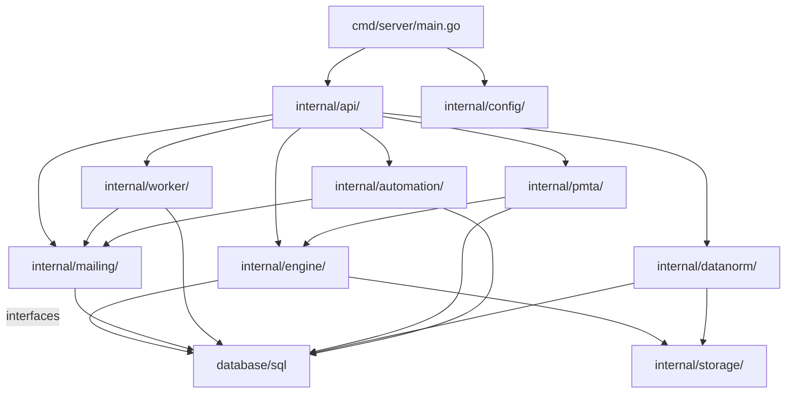

# IGNITE Platform Architecture

## Package Dependency Graph

## Layer Responsibilities

| Layer | Package | Responsibility |
|-------|---------|---------------|
| Entry point | `cmd/server/` | Configuration loading, dependency wiring, HTTP server lifecycle |
| HTTP handlers | `internal/api/` | Request parsing, response formatting, route registration, middleware |
| Business logic | `internal/mailing/` | Campaign scheduling, tracking, subscriber management, A/B testing |
| Engine | `internal/engine/` | PMTA multi-agent governance system (48 agents across 8 ISPs) |
| Workers | `internal/worker/` | Background jobs: batch sending, email verification, partition management |
| PMTA | `internal/pmta/` | PMTA integration: accounting parser, warmup scheduler, SSH executor |
| Data normalization | `internal/datanorm/` | S3 import pipeline: classify, normalize, import CSV subscriber data |
| Automation | `internal/automation/` | Event-driven automation flows (welcome series, drip campaigns) |
| Storage | `internal/storage/` | AWS S3 client wrapper |
| Config | `internal/config/` | YAML + env var configuration loading |
| Logging | `internal/pkg/logger/` | Structured JSON logging with PII redaction |

## Data Flow: S3 Import → Normalize → Subscriber → Campaign → Send → Track

1. **S3 Polling**: `datanorm.Normalizer` polls `jvc-email-data` bucket every 5 minutes
2. **Classification**: `datanorm.Classifier` determines file type (mailable / suppression / warmup)
3. **Rename**: Files moved to `processed/00x-JVC-{Type}.csv`
4. **Import**: `datanorm.Importer` batch-upserts into `mailing_subscribers` (mailable/warmup) or `mailing_global_suppressions` (suppression)
5. **Verification**: `worker.EmailVerifier` validates imported emails via MX lookup + third-party API
6. **Quality scoring**: `data_quality_score` progresses: 0.00 (imported) → 0.25 (MX valid) → 0.50 (API verified) → 0.75 (delivered) → 1.00 (engaged)
7. **Warmup selection**: `pmta.WarmupScheduler` selects recipients by quality tier per warmup day
8. **Campaign send**: `worker.BatchSendWorker` resolves A/B variants via `mailing.VariantSelector`, sends via PMTA
9. **Tracking**: `mailing.TrackingService` injects open pixel + click redirect; enriches owned-domain redirects with `eid/cid/sid`
10. **Site engagement**: `EmailTracker.tsx` on discountblog.com fires page_view / session_end beacons to `POST /api/v1/site-events`
11. **Event store**: All events flow into `subscriber_events` partitioned table
12. **Dashboard**: WebSocket hub broadcasts high-value events to React dashboard in real time

## Data Flow: PMTA Accounting → Events → Dashboard

1. **PMTA accounting**: PMTA writes CSV accounting records (delivery, bounce, complaint, deferral)
2. **Ingestor**: `engine.Ingestor` receives parsed `AccountingRecord` structs
3. **Signal processing**: `engine.SignalProcessor` computes rolling-window metrics (bounce/complaint/deferral rates)
4. **Agent evaluation**: 48 agents (6 types × 8 ISPs) evaluate signals against rules
5. **Decisions**: Agents emit `Decision` structs (throttle, pause, quarantine, emergency halt)
6. **Orchestrator**: Validates decisions, persists via `DecisionStore` interface, dispatches to executor
7. **Executor**: Applies PMTA commands (queue pause/resume, IP disable)
8. **Event writing**: Delivery/bounce events written to `subscriber_events` for subscriber profiles
9. **Quality updates**: Delivered = score 0.75; bounced = suppress + score 0.00

## Key Tables

| Table | Purpose | Partitioning |
|-------|---------|-------------|
| `subscriber_events` | All subscriber lifecycle events (fact table) | Monthly by `event_at` |
| `mailing_subscribers` | Subscriber profiles with quality scores | — |
| `mailing_campaigns` | Campaign definitions and status | — |
| `mailing_ab_tests` / `mailing_ab_variants` | A/B test configuration | — |
| `content_learnings` | Aggregated A/B test winning patterns | — |
| `automation_flows` | Event-triggered automation definitions | — |
| `automation_executions` | Running/completed automation instances | — |
| `data_import_log` | S3 file import tracking and audit trail | — |
| `mailing_global_suppressions` | Cross-ISP suppression list (MD5 indexed) | — |
| `mailing_engine_suppressions` | Per-ISP suppression list | — |
| `mailing_engine_decisions` | Agent governance decisions | — |
| `mailing_engine_signals` | Rolling-window signal metrics | — |
