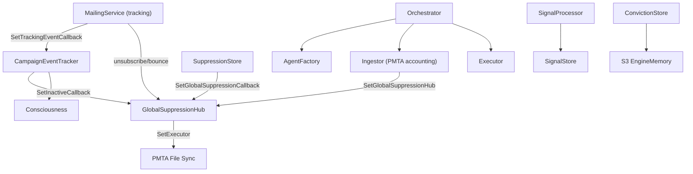
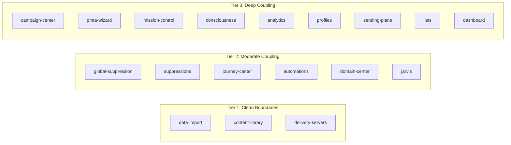

# Microservice Decomposition: Level of Effort Analysis

## Current State: The Coupling Problem

The entire backend is wired in a single 685-line function ([server_routes_mailing.go](internal/api/server_routes_mailing.go)) that instantiates ~40 services with deeply interleaved callback chains. This is the core obstacle.

### Critical Callback Chains (would become inter-service events)




### Shared Database Tables (the hardest part to split)

- `**mailing_subscribers**` -- accessed by **16 files** (lists, campaigns, PMTA wizard, journeys, automation, intelligence, scheduler, verifier)
- `**mailing_sending_profiles`** -- accessed by **16 files** (campaigns, PMTA, Jarvis, domain center, workers)
- `**mailing_campaigns`** -- accessed by **13 files** (builder, scheduler, sending, webhooks, automation, intelligence, metrics)
- `**mailing_inbox_profiles`** -- accessed by **13 files** (profiles, sending, tracking, intelligence, Jarvis, ISP agents)

### Background Processes Started Inside Route Registration

9 background schedulers/pollers start within `SetMailingDB()`: orchestrator (48 agents), consciousness, ISP learner, suppression refresh engine, PMTA collector, warmup scheduler, blacklist monitor, IPXO sync, global hub file sync. Each would need its own lifecycle management as a service.

---

## Navigation Items Mapped to Natural Service Boundaries




### Tier 1 -- Clean Boundaries (1-2 weeks each)

- **data-import**: `datanorm_handler.go` + `internal/datanorm/` (8 files, ~1,700 lines). Only needs `*sql.DB`. Writes to subscriber/suppression tables then exits. Could be an async worker service.
- **content-library**: `mailing_templates.go`. Simple CRUD against `mailing_templates` table. No callbacks, no shared state.
- **delivery-servers**: `handlers_pmta.go` + Vultr/OVH/IPXO handlers. External integrations with their own API clients. Reads `mailing_pmta_servers` and `mailing_sending_profiles`.

### Tier 2 -- Moderate Coupling (2-4 weeks each)

- **global-suppression**: Owns `mailing_global_suppressions`, but is a *consumer* of events from 5 other systems (bounces, unsubscribes, inactive detection, FBL reports, PMTA accounting). Extracting means replacing all callback chains with an event bus.
- **suppressions**: `suppression_service.go` + import + refresh engine. Owns `mailing_suppressions` and `mailing_suppression_lists`, but sending pipeline queries them at send time.
- **journey-center**: `journey_center*.go` + `journey_builder.go`. Moderately isolated but reads subscribers and tracking events, and uses MailingService for email sending.
- **automations**: `mailing_automation.go`. Depends on lists and campaigns for enrollment triggers.
- **domain-center**: Tracking domains + image CDN + sending profiles. Sending profiles are read by 16 files -- this table would need a shared API.
- **jarvis**: `jarvis_orchestrator.go` + related. Uses MailingService and sending profiles but has its own state machine.

### Tier 3 -- Deep Coupling (4-8 weeks each)

- **campaign-center**: The CampaignBuilder is the heart of the system. Depends on lists, segments, suppression, sending profiles, global suppression, Redis, tracking events. Other services depend ON it.
- **pmta-wizard**: Depends on lists, segments, suppressions, templates, sending profiles, engine orchestrator, conviction store, signal processor.
- **mission-control**: Real-time campaign monitoring + simulation. Depends on live campaign state, ISP agents.
- **consciousness**: Wired to conviction store, signal processor, campaign tracker, S3 engine memory. Tightly coupled to the PMTA governance engine.
- **analytics**: Pure read model, but aggregates from campaigns, tracking events, profiles, ISP agents, send times -- reads from nearly every table.
- **profiles** (Inbox Intel): Cross-cutting read model across inbox profiles, ISP agents, analytics decisions.
- **sending-plans**: ISP agent intelligence, deeply interleaved with campaign sending.
- **lists**: Owns `mailing_subscribers` (the most shared table). Foundation service -- must exist before campaigns, PMTA wizard, automations, journeys can function.
- **dashboard**: Aggregates counts from all major tables. Would become a BFF/gateway aggregator.

---

## Three Strategies

### Strategy A: True 1:1 Nav-to-Microservice (18 services)

**Effort: 9-14 months, 3-4 engineers**

Infrastructure requirements (before any service extraction):

- API Gateway with auth propagation: ~3 weeks
- Event bus (Kafka/NATS) for replacing callback chains: ~3 weeks
- Service discovery + health checking: ~2 weeks
- Database-per-service migration strategy: ~6-10 weeks
- CI/CD pipelines per service: ~3 weeks
- Distributed tracing + observability: ~3 weeks
- Infrastructure subtotal: **~20-24 weeks**

Per-service extraction (sequential, due to dependency ordering):

- Phase 1 (Tier 1): 3 services, ~5 weeks
- Phase 2 (Tier 2): 6 services, ~18 weeks
- Phase 3 (Tier 3): 9 services, ~48 weeks (but some can parallelize to ~30 weeks with 2 engineers)

Risks:

- Operational complexity explosion (18 deployables, 18 log streams, 18 health checks)
- Distributed transaction failures where callbacks currently guarantee atomicity
- Many services would be extremely thin (content-library is essentially one CRUD handler)
- Network latency replacing in-process function calls in hot paths (send pipeline)

### Strategy B: Bounded Context Services (~8 services)

**Effort: 5-8 months, 2-3 engineers**

Group related tabs into bounded contexts that share a database schema:


| Service            | Nav Tabs                                          | Key Tables Owned                                     | Go Files | Est. Effort |
| ------------------ | ------------------------------------------------- | ---------------------------------------------------- | -------- | ----------- |
| **Audience**       | lists, data-import                                | mailing_subscribers, mailing_lists, mailing_segments | ~25      | 4 weeks     |
| **Campaign**       | campaign-center, pmta-wizard, mission-control     | mailing_campaigns, mailing_ab_tests                  | ~30      | 6 weeks     |
| **Suppression**    | suppressions, global-suppression                  | mailing_suppressions, mailing_global_suppressions    | ~15      | 3 weeks     |
| **Content**        | content-library, domain-center                    | mailing_templates, mailing_tracking_domains          | ~12      | 2 weeks     |
| **Intelligence**   | consciousness, analytics, profiles, sending-plans | mailing_inbox_profiles, mailing_isp_agents           | ~25      | 5 weeks     |
| **Journey**        | journey-center, automations                       | mailing_journeys, mailing_automations                | ~15      | 3 weeks     |
| **Infrastructure** | delivery-servers                                  | mailing_pmta_servers (Vultr, OVH, IPXO)              | ~10      | 2 weeks     |
| **Orchestration**  | jarvis, dashboard                                 | (aggregator, no owned tables)                        | ~15      | 4 weeks     |


Infrastructure overhead: ~12-16 weeks (same items as Strategy A but fewer services to manage)

Risks:

- Still requires event bus for global suppression fan-in
- Campaign service is still large and complex
- Database schema splitting is still the bottleneck

### Strategy C: Modular Monolith First, Extract Later (Recommended)

**Effort: 2-3 months, 1-2 engineers**

Restructure internally without changing deployment topology:

```
internal/
  modules/
    audience/       # lists, segments, subscribers, data-import
      handler.go    # HTTP handlers
      service.go    # Business logic (no *sql.DB in handlers)
      repository.go # Data access interface
      postgres.go   # Repository implementation
      module.go     # RegisterRoutes + dependency wiring
    campaign/       # campaign-center, pmta-wizard, mission-control
    suppression/    # suppressions, global-suppression
    content/        # content-library, domain-center
    intelligence/   # consciousness, analytics, profiles, ISP agents
    journey/        # journey-center, automations
    infra/          # delivery-servers, Vultr, OVH, IPXO
    orchestration/  # jarvis, dashboard
  shared/
    events/         # In-process event bus (interface-based, swappable to Kafka later)
    auth/           # JWT/org context extraction
    db/             # Connection pool management
```

Phase 1 -- Define module boundaries and interfaces (2 weeks):

- Create module interfaces (each module exposes a `Service` interface)
- Replace direct DB access in handlers with repository interfaces
- In-process event bus replaces callback chains

Phase 2 -- Extract modules one by one (6-8 weeks):

- Start with Tier 1 (data-import, content, delivery-servers)
- Then Tier 2 (suppression, journey, automations)
- Then Tier 3 (campaign, intelligence, orchestration)
- Each extraction is a refactor commit, not a new deployable

Phase 3 -- Optional: Extract to true services (when needed):

- Any module can become a service by swapping in-process calls for HTTP/gRPC
- Swap in-process event bus for Kafka/NATS
- Each extraction is now mechanical, not architectural

Benefits:

- Zero infrastructure overhead
- Every module is independently testable TODAY (mock the interfaces)
- Deployment stays simple (single binary + workers)
- Extraction to true microservices becomes mechanical when scale demands it
- Follows the existing `internal/service/campaign/` and `internal/service/suppression/` patterns already in the codebase

---

## Recommendation

Strategy C (Modular Monolith) is the pragmatic choice for the current team size and codebase maturity. It achieves the vertical slice isolation and testability goals without the operational burden of 8-18 independently deployed services. The existing patterns in `internal/service/campaign/` and `internal/service/suppression/` (with Repository interfaces and in-memory mocks) already prove this architecture works in this codebase.

Strategy B becomes viable when you have 3+ engineers AND a clear scaling bottleneck (e.g., audience queries slowing down campaign sends). At that point, the modular monolith boundaries make extraction surgical rather than archaeological.

Strategy A is only justified if you have independent teams that need to deploy at different cadences -- which is an organizational problem, not a technical one.